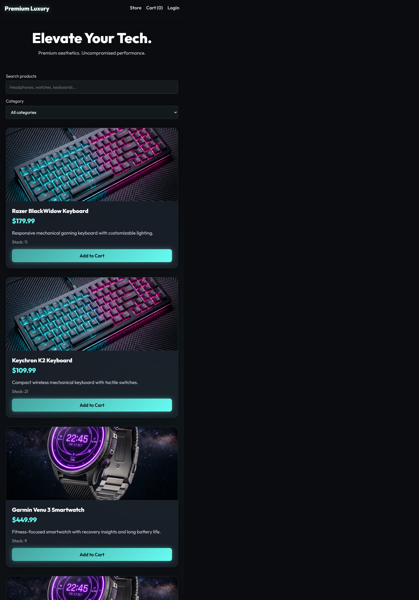

# Aura | The Curated Tech Store 🛒✨

Aura is a small electronics storefront built around one idea: make the whole shopping journey feel clear, from finding a useful piece of tech to seeing it safely through a demo checkout.

Shoppers can browse and filter a curated catalog, check stock, adjust a cart, and return to their order history. Store admins get a separate workspace to shape that catalog. The application is built with Node.js, Express, MongoDB, and a vanilla JavaScript interface.



## 🚀 Features

- **Product catalog:** Debounced name search, category filtering, and server-side pagination with stable newest-first ordering.
- **Authentication:** Registration and login with bcrypt password hashing and JWT bearer tokens. Public registration always creates a standard user.
- **Admin inventory:** Admins can view, create, edit, and delete products through the storefront; the API enforces admin permissions server-side.
- **Shopping cart:** Add and remove products, adjust quantities, and check stock before accepting quantity changes.
- **Orders:** Simulated checkout and authenticated order history scoped to the signed-in user.
- **Security:** Helmet security headers and CSP, a 100-request-per-15-minute API rate limit, escaped search patterns, and safe DOM text rendering.
- **Repeatable catalog setup:** The seed script inserts missing sample products without deleting or overwriting existing records.

## ⚙️ Engineering Details

### 📦 Inventory and checkout

Checkout decrements inventory with a conditional MongoDB update. Each decrement succeeds only when the product still has enough stock, preventing that individual operation from overselling. If a later checkout step fails, the controller attempts to restore prior deductions and remove an order it created.

This compensation flow is **not a transaction across the entire checkout**; a rollback can fail and require reconciliation. Payment is simulated with an 80% success rate. No payment provider is integrated.

### 🔎 Pagination and search

`GET /api/products` defaults to page 1 with 8 products per page. The API accepts a maximum page size of 50 and sorts by `createdAt` descending, then `_id` descending for deterministic page boundaries. It keeps an array response body and sends pagination metadata in `X-Page`, `X-Limit`, `X-Total-Pages`, and `X-Total-Products` headers.

Search terms are length-bounded and regex-escaped, so user input is treated as literal text rather than executable regular-expression syntax.

### 🔐 Authorization

Product create, update, and delete endpoints require a valid JWT for an admin account. Public registration cannot assign the admin role. To bootstrap an admin for a local demo, register normally and update that user's `role` field to `admin` in MongoDB.

## 🧰 Technology Stack

| Area | Technologies |
| --- | --- |
| Runtime and API | Node.js, Express 5 |
| Database and models | MongoDB, Mongoose 9 |
| Authentication | JSON Web Tokens, bcrypt |
| Security middleware | Helmet, express-rate-limit |
| Frontend | HTML, CSS, vanilla JavaScript |
| Testing | Node.js built-in test runner, Express HTTP route tests |

## 🚀 Getting Started

### 📋 Requirements

- Node.js 18 or later
- MongoDB running locally or a MongoDB Atlas connection string

### 📥 Install Dependencies

From the project directory:

```bash
npm install
```

Create a `.env` file in the project root:

```ini
PORT=5000
MONGO_URI=mongodb://127.0.0.1:27017/ecommerce
JWT_SECRET=replace_with_a_long_random_secret
```

For Atlas, use your Atlas connection string for `MONGO_URI`. Keep `.env` out of source control and use a unique, randomly generated `JWT_SECRET` outside local development.

### 🌱 Seed Sample Products

```bash
npm run seed
```

Seeding is additive and idempotent by product name; it preserves existing products.

### ▶️ Run the App

```bash
npm run dev
```

Open [http://localhost:5000](http://localhost:5000). Set `PORT` in `.env` if port 5000 is already in use.

### 🧪 Run Tests

```bash
npm test
```

The default test suite runs without MongoDB. It includes controller tests and HTTP requests through the product and cart Express routers; database model calls are mocked.

## 🔑 Admin Setup

1. Register an account through the storefront.
2. In MongoDB Compass, open the configured database and its `users` collection.
3. Change that account's `role` field from `user` to `admin`.
4. Log out and sign in again. The Admin Panel link will appear.

Never accept an admin role from public registration input; the server intentionally assigns new accounts the `user` role.

## 🔌 API Reference

All endpoints are mounted beneath `/api`. Private endpoints require `Authorization: Bearer <token>`.

| Method | Endpoint | Access | Description |
| --- | --- | --- | --- |
| `POST` | `/api/users/register` | Public | Register a standard user |
| `POST` | `/api/users/login` | Public | Authenticate and return a token |
| `GET` | `/api/products?page=1&limit=8&keyword=&category=` | Public | Search and retrieve a product page |
| `GET` | `/api/products/:id` | Public | Retrieve one product |
| `POST` | `/api/products` | Admin | Create a product |
| `PUT` | `/api/products/:id` | Admin | Update a product |
| `DELETE` | `/api/products/:id` | Admin | Delete a product |
| `GET` | `/api/cart` | Private | Retrieve the signed-in user's cart |
| `POST` | `/api/cart` | Private | Add an item to the cart |
| `PUT` | `/api/cart/:productId` | Private | Set an item's quantity |
| `DELETE` | `/api/cart/:productId` | Private | Remove an item from the cart |
| `POST` | `/api/orders/checkout` | Private | Simulate payment and create an order |
| `GET` | `/api/orders` | Private | Retrieve the signed-in user's orders |

Example paginated catalog request:

```text
GET /api/products?page=2&limit=8&keyword=watch&category=Wearables
```

Pagination metadata is returned in the `X-Page`, `X-Limit`, `X-Total-Pages`, and `X-Total-Products` headers.

## 🗂️ Project Structure

```text
config/          MongoDB connection setup
controllers/     Request handling and business logic
middleware/      JWT authorization and error handling
models/          Mongoose schemas
public/          Storefront HTML, CSS, JavaScript, and images
routes/          Express route definitions
tests/           Unit and HTTP route tests
utils/           Token generation helper
server.js        Middleware, API mounting, and static hosting
seed.js          Additive sample-product seeder
```

## 🎯 Product Direction

Aura is designed as a focused tech boutique rather than a sprawling marketplace. The storefront, cart, order history, and admin inventory tools are all part of one compact shopping experience. Checkout is intentionally simulated, so the project can demonstrate the order and inventory flow without processing real payments.
